# Jarpa

* Jarpa consta de 3 proyectos.
* En cada apartado encontrarás el enlace a la wiki de la estructura de cada proyecto y capturas de pantalla en el caso de aplicación móvil y página de administración.
* El backend de la aplicación y la web de administración están desplegadas en una instancia de Amazon Web Services.
* El proyecto dispone de Integración Continua con Jenkins.
* Las contraseñas, email y nombres de usuario se guardan en la base de datos encriptados. Solo se se desencripta cuando el usuario hace click sobre ellos.

### [Jarpa Security](https://github.com/joseanfernandez/jarpa-security) 
Aplicación móvil que nos permite tener todas nuestras contraseñas seguras bajo una única contraseña.
Con un solo click podrás copiar la contraseña al portapapeles sin necesidad de ver esa contraseña.
Deslizando cada item de la lista a derecha o izquierda, veremos las opciones disponibles.
* Derecha: Iconos de email y/o nombre usuario, con un click estará copiado al portapapeles.
* Izquierda: Editar cuenta o eliminarla.

Si tu terminal dispone de lector de huella dactilar, tras el primer login podrás empezar a usarlo como método de autenticación.

[Descargar APK](https://github.com/joseanfernandez/Jarpa/raw/master/Jarpa.apk)

[Estructura](https://github.com/joseanfernandez/Jarpa/wiki/Jarpa-Security)

|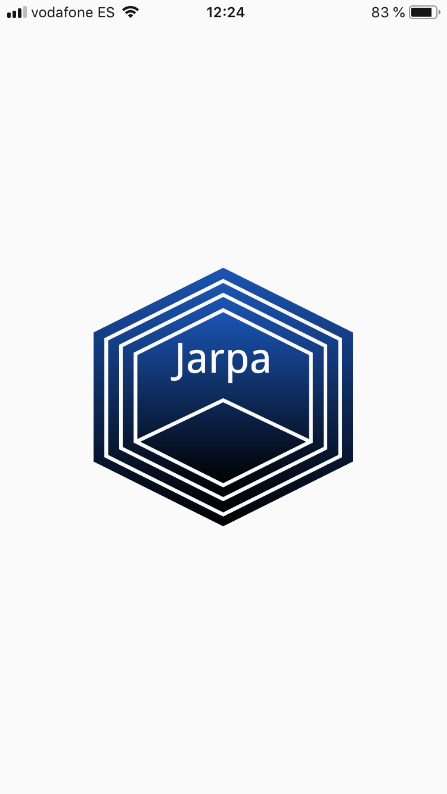|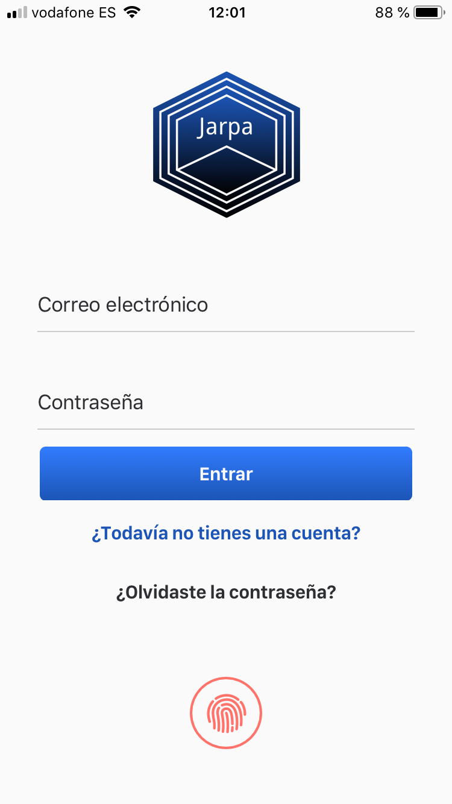|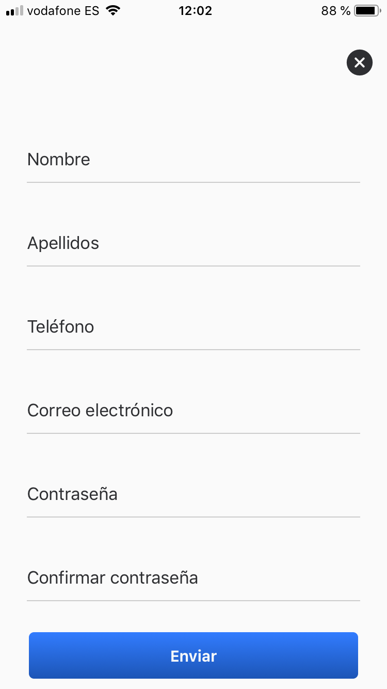|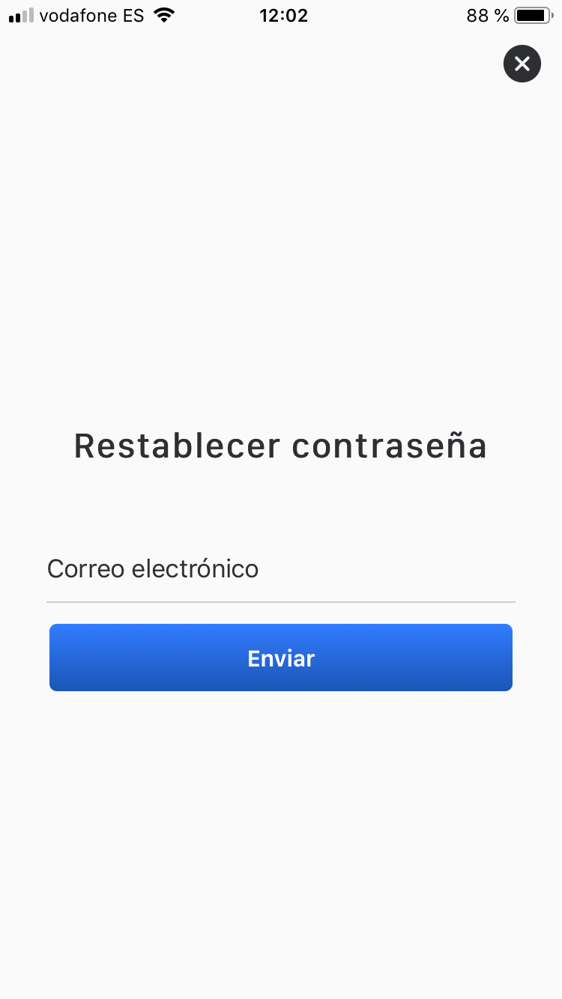|
|----------|----------|----------|----------|

|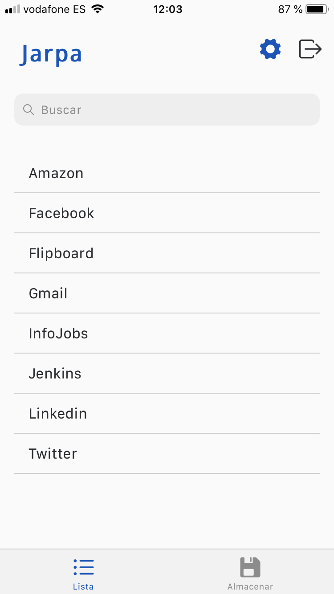|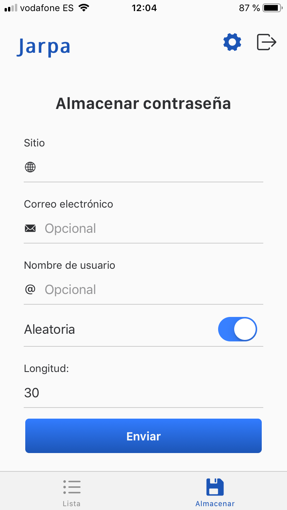|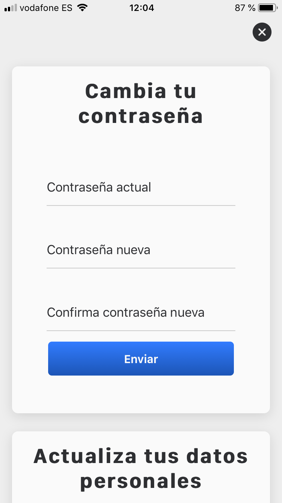|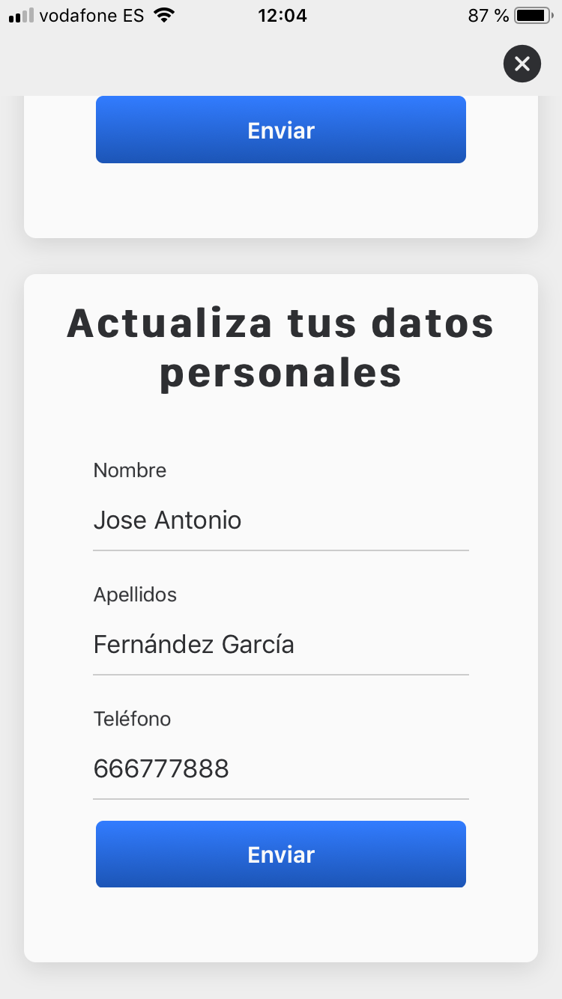|
|----------|----------|----------|----------|
### [Jarpa Admin](https://github.com/joseanfernandez/jarpa-admin)
Página de administración, donde podemos ver estadísticas de usuarios y contraseñas, además de gestionar los estados de los usuarios.
Haciendo click sobre el usuario se nos permitirá:
* Suspenderlo si está activo.
* Activarlo si estás suspendido.
* Eliminarlo.

[https://jarpa.joseanfernandez.com](https://jarpa.joseanfernandez.com)

Credenciales de prueba:
* Email: admin@jarpasecurity.com 
* Passoword: a12345678
  
[Estructura](https://github.com/joseanfernandez/Jarpa/wiki/Jarpa-Admin)

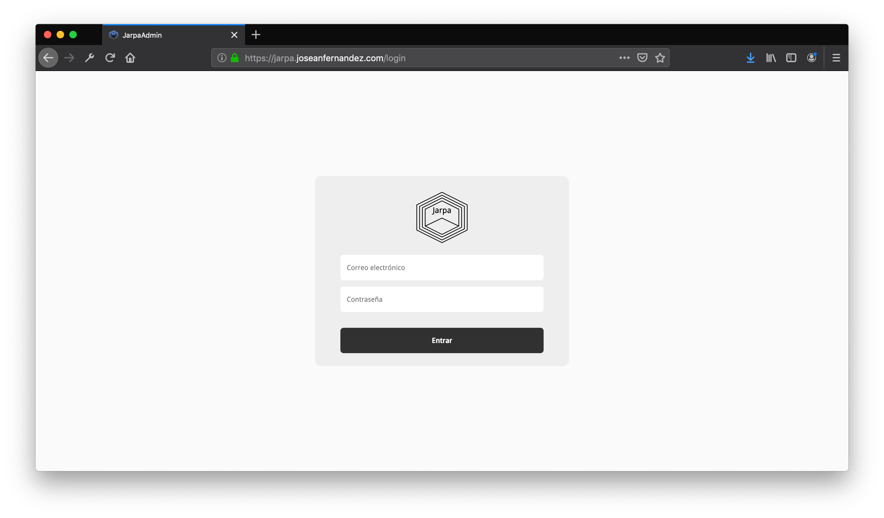
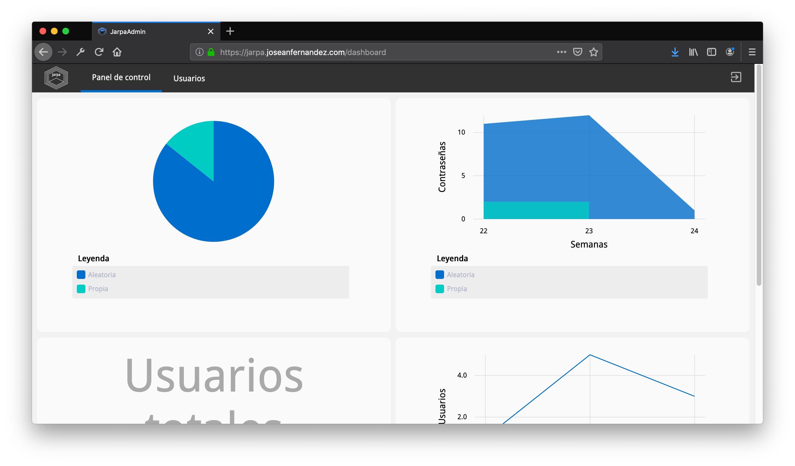
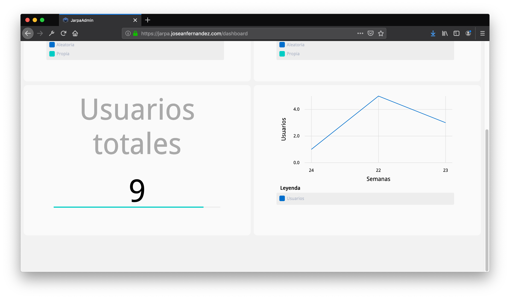
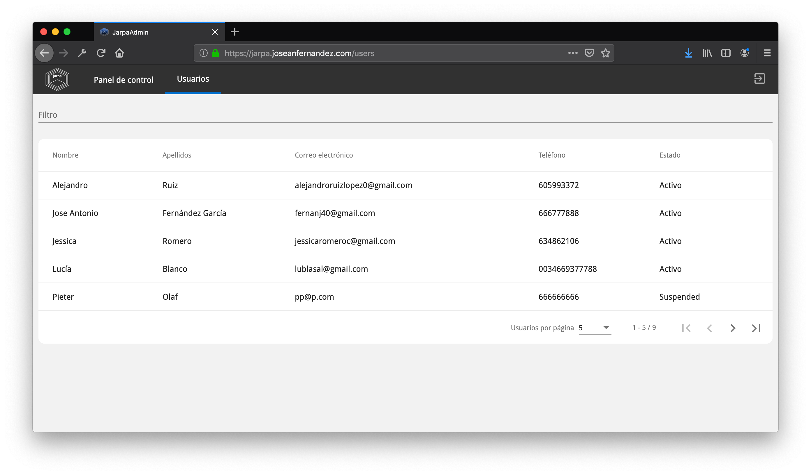

### [Jarpa Engine](https://github.com/joseanfernandez/jarpa-engine)
Motor de toda la aplicación.

[Estructura](https://github.com/joseanfernandez/Jarpa/wiki/Jarpa-Engine)

## Tecnolgías utilizadas

|||||
|----------|----------|----------|----------|

||||
|----------|----------|----------|
